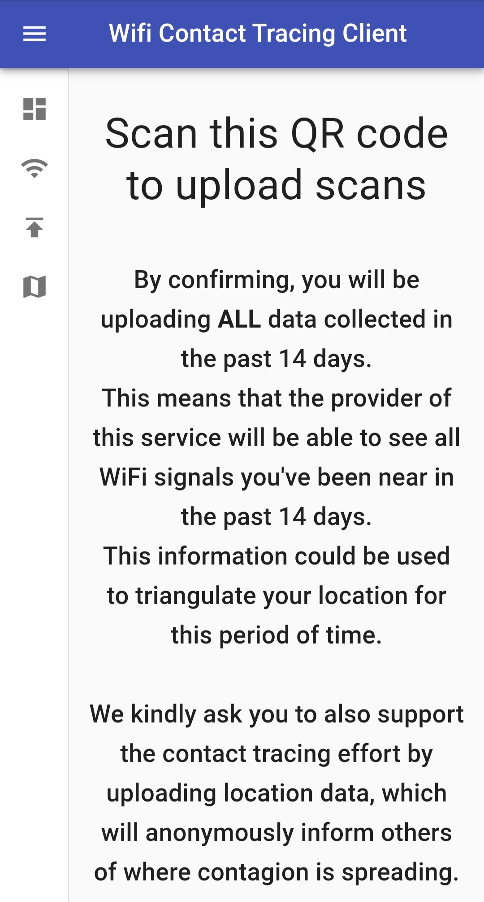
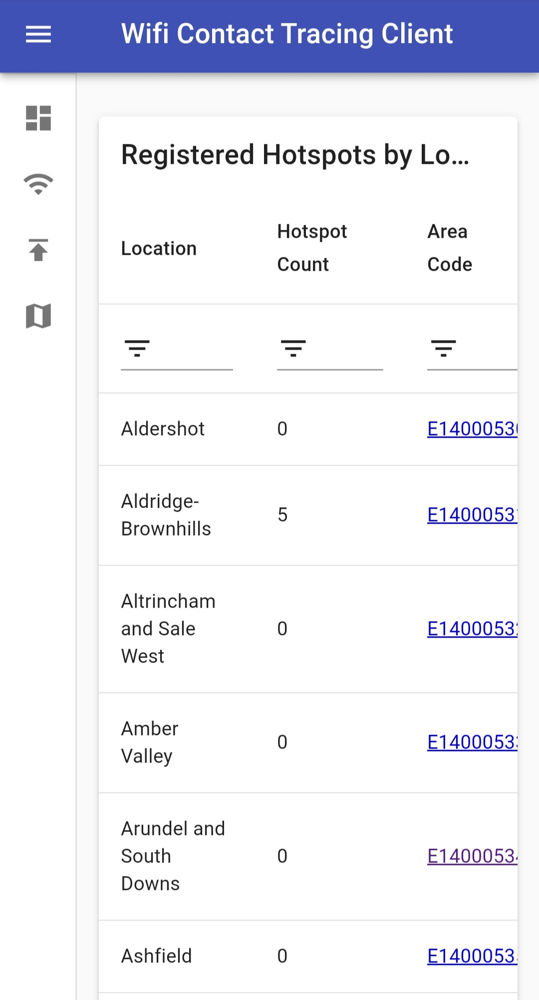
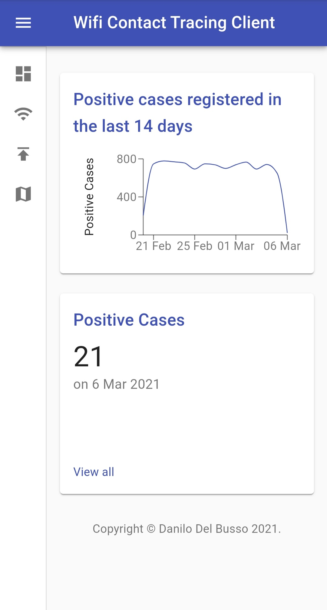

[![Release][release-shield]][release-url]
[![Forks][forks-shield]][forks-url]
[![Stargazers][stars-shield]][stars-url]
[![Issues][issues-shield]][issues-url]
[![MIT License][license-shield]][license-url]
[![LinkedIn][linkedin-shield]][linkedin-url]

<!-- PROJECT LOGO -->
<br />
<p align="center">
  <a href="https://github.com/wifi-tracing/client">
    
  </a>

<h3 align="center">Client</h3>

  <p align="center">
    Web client for a WiFi based contact tracing application, developed as part of <a href="https://github.com/danilo-delbusso"><b>@danilo-delbusso</b></a>'s a final year project
    <br />
    <a href="https://github.com/wifi-tracing/client/issues">Report Bug</a>
  </p>
</p>

# ℹ About The Project

The project is aimed at creating a web client to easily interface with data collected about contagion.

It does not implement authentication, and it's mainly used for data visualisation, as well as generating QR codes to
upload data.

<p align="center">
  
&nbsp; &nbsp; 
  
  &nbsp; &nbsp;
    
</p>


# 💽 Installation

This client fetches data from the [server](https://github.com/wifi-tracing/server) module. You should make sure you have a working instance of it running.

## 🐋 Docker

This installation is the fastest, but requires [Docker](https://docs.docker.com/engine/install/#server).

This installation is also suggested for running on remote servers and cloud service providers.

Once you have Docker run

```bash
docker build -t client . && docker run -it client
```

The client will be available at `http://localhost:3000`

## 💻 Local Installation

To install locally without the use of Docker you will need the following dependencies installed and configured on your system:

- [Node.js](https://docs.npmjs.com/downloading-and-installing-node-js-and-npm)
- [npm](https://docs.npmjs.com/downloading-and-installing-node-js-and-npm)
- [MongoDB](https://docs.mongodb.com/manual/installation/)

It is suggested to install Node.js and npm using [nvm](https://github.com/nvm-sh/nvm#install--update-script).

Install local dependencies

```bash
npm install
```
And then run

```bash
npm start
```
# ⚙ Configuration

This repository contains a pre-packaged configuration in the form of an .env file.

While it is useful to demo and run the application, it is important to **CHANGE THE VALUES** for security reasons.

This is an overview of the used .env values:

| Name                            	| Description                                                   	| Default Value         	|
|---------------------------------	|---------------------------------------------------------------	|-----------------------	|
| REACT_APP_MODE                  	| production if running the app in production, dev if otherwise 	| production            	|
| REACT_APP_SERVER_URL_PRODUCTION 	| The URL of the API when REACT_APP_MODE=production             	| http://localhost:4683 	|
| REACT_APP_SERVER_URL            	| The URL of the API when REACT_APP_MODE=dev                    	| http://localhost:4683 	|

# 🗺 Roadmap

See the [open issues](https://github.com/wifi-tracing/client/issues) for a list of proposed features (and known issues).

# 💁 Contributing

Contributions are what make the open source community such an amazing place to be learn, inspire, and create.

The repo itself is just used to show the project. It is **NOT** actively maintained. The author suggests forking the
project instead of opening new issues.
# ⚖ License

Distributed under the MIT License. See `LICENSE` for more information.

# 🐦 Contact

Danilo Del Busso - [@danilo_delbusso](https://twitter.com/danilo_delbusso)

# 🙏 Attributions

<div>Icons made by <a href="https://www.freepik.com" title="Freepik">Freepik</a> from <a href="https://www.flaticon.com/" title="Flaticon">www.flaticon.com</a></div>


[release-shield]: https://img.shields.io/github/v/release/wifi-tracing/server?style=for-the-badge

[release-url]: https://github.com/wifi-tracing/server/releases

[forks-shield]: https://img.shields.io/github/forks/wifi-tracing/client.svg?style=for-the-badge

[forks-url]: https://github.com/wifi-tracing/client/network/members

[stars-shield]: https://img.shields.io/github/stars/wifi-tracing/client.svg?style=for-the-badge

[stars-url]: https://github.com/wifi-tracing/client/stargazers

[issues-shield]: https://img.shields.io/github/issues/wifi-tracing/client.svg?style=for-the-badge

[issues-url]: https://github.com/wifi-tracing/client/issues

[license-shield]: https://img.shields.io/github/license/wifi-tracing/client.svg?style=for-the-badge

[license-url]: https://github.com/wifi-tracing/client/blob/master/LICENSE.txt

[linkedin-shield]: https://img.shields.io/badge/-LinkedIn-black.svg?style=for-the-badge&logo=linkedin&colorB=555

[linkedin-url]: https://www.linkedin.com/in/danilo-delbusso/
